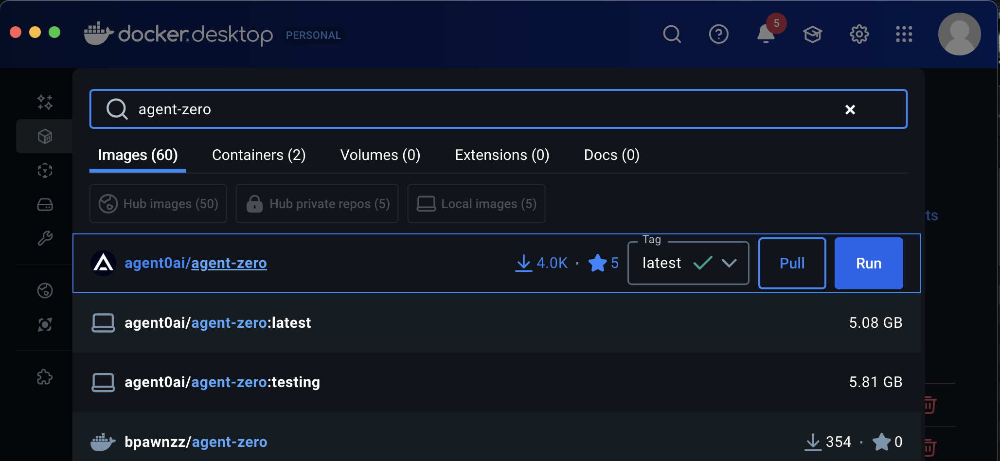
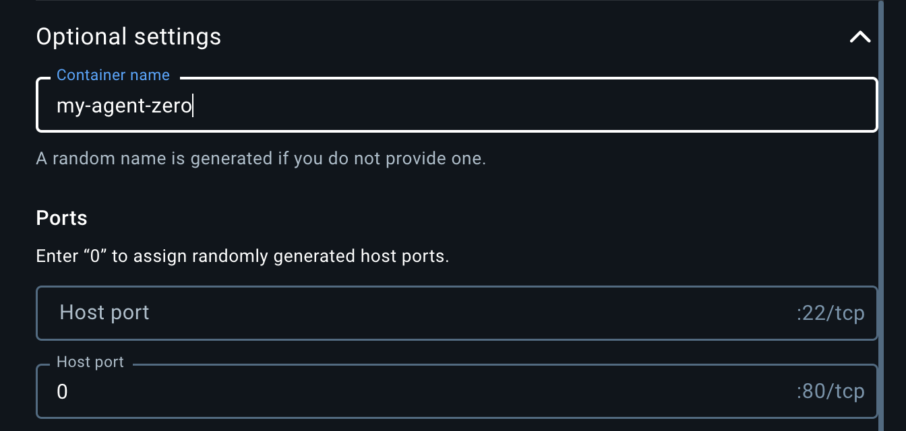
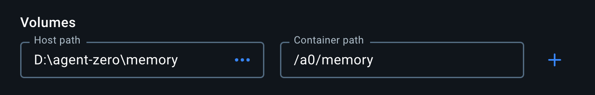
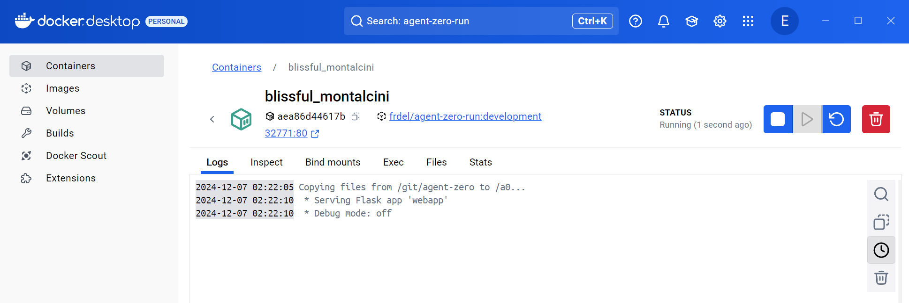
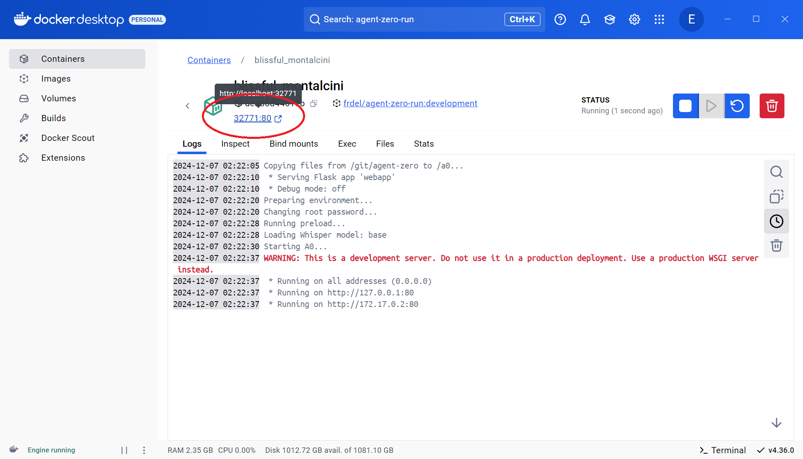
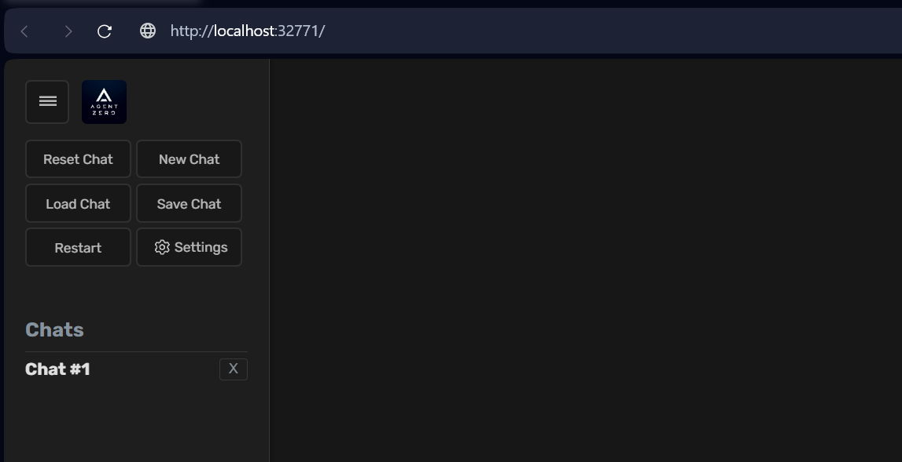
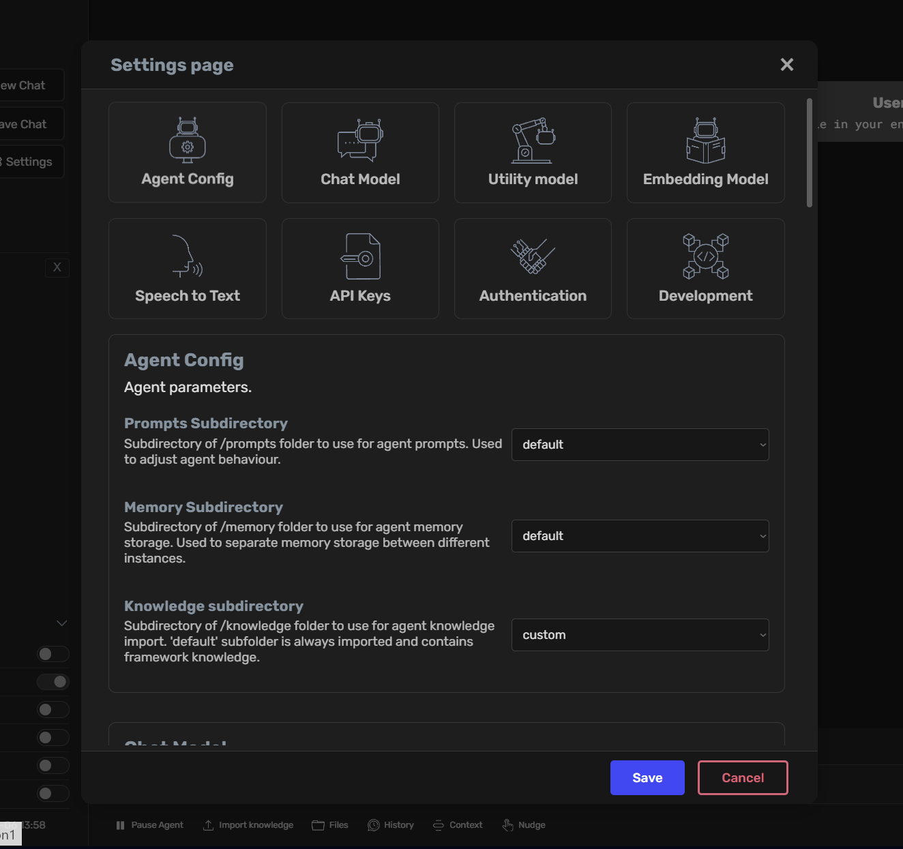
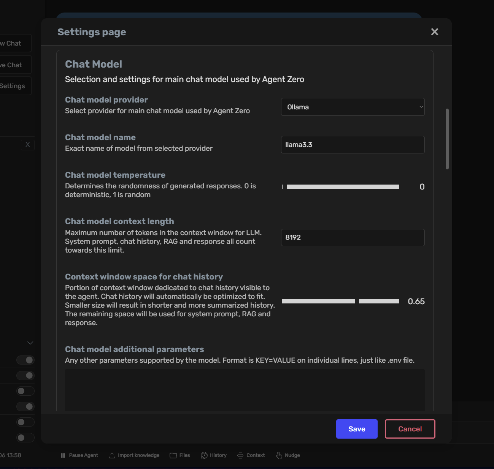
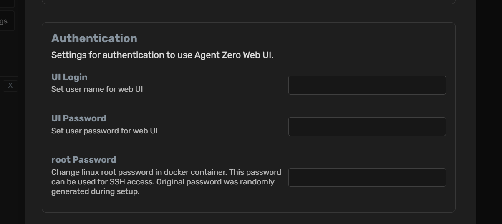
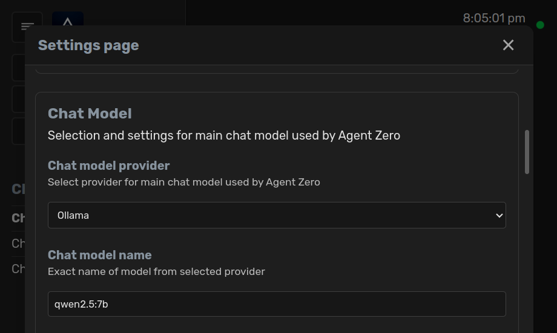

# Users installation guide for Windows, macOS and Linux

Click to open a video to learn how to install Agent Zero:

[](https://www.youtube.com/watch?v=w5v5Kjx51hs)

The following user guide provides instructions for installing and running Agent Zero using Docker, which is the primary runtime environment for the framework. For developers and contributors, follow the [development guide](development.md) to set up a hybrid local + Docker workflow.


## Windows, macOS and Linux Setup Guide


1. **Install Docker Desktop:** 
- Docker Desktop provides the runtime environment for Agent Zero, ensuring consistent behavior and security across platforms
- The entire framework runs within a Docker container, providing isolation and easy deployment
- Available as a user-friendly GUI application for all major operating systems

1.1. Go to the download page of Docker Desktop [here](https://www.docker.com/products/docker-desktop/). If the link does not work, just search the web for "docker desktop download".

1.2. Download the version for your operating system. For Windows users, the Intel/AMD version is the main download button.


<br><br>

> [!NOTE]
> **Linux Users:** You can install either Docker Desktop or docker-ce (Community Edition). 
> For Docker Desktop, follow the instructions for your specific Linux distribution [here](https://docs.docker.com/desktop/install/linux-install/). 
> For docker-ce, follow the instructions [here](https://docs.docker.com/engine/install/).
>
> If you're using docker-ce, you'll need to add your user to the `docker` group:
> ```bash
> sudo usermod -aG docker $USER
> ```
> Log out and back in, then run:
> ```bash
> docker login
> ```

1.3. Run the installer with default settings. On macOS, drag and drop the application to your Applications folder.


<br><br>

1.4. Once installed, launch Docker Desktop: 


<br><br>

> [!NOTE]
> **MacOS Configuration:** In Docker Desktop's preferences (Docker menu) → Settings → 
> Advanced, enable "Allow the default Docker socket to be used (requires password)."


2. **Run Agent Zero:**

- Note: The Hacker Edition profile is included in the main Docker image. After first launch, select the `hacker` profile in **Settings → Agent Config → Default agent profile**.

2.1. Pull the Agent Zero Docker image:
- Search for `agent0ai/agent-zero` in Docker Desktop
- Click the `Pull` button
- The image will be downloaded to your machine in a few minutes



> [!TIP]
> Alternatively, run the following command in your terminal:
>
> ```bash
> docker pull agent0ai/agent-zero
> ```

2.2. OPTIONAL - Create a host folder for working files:

> [!CAUTION]
> The recommended way to persist Agent Zero data across upgrades is **Backup & Restore** in the Settings UI.
> Do **not** map the entire `/a0` directory. It contains the application code and will cause upgrade conflicts.

- If you want the agent to work with files from your host machine without attaching them, map **one specific folder**.
- Examples:
  - Map a working folder: `-v /path/to/your/data:/root/data`
  - Map project files: `-v /path/to/your/projects:/a0/usr/projects`

> [!TIP]
> Keep host mappings narrow and purpose-driven. Use Backup & Restore for settings, memories, and knowledge.

2.3. Run the container:
- In Docker Desktop, go back to the "Images" tab
- Click the `Run` button next to the `agent0ai/agent-zero` image
- Open the "Optional settings" menu
- Set the web port (80) to desired host port number in the second "Host port" field or set to `0` for automatic port assignment

> [!IMPORTANT]
> The Web UI is served on container port **80**. You must map at least one host port to container port 80 (or set host to `0` for a random port) to access the UI.

Optionally you can map local folders for file persistence:
> [!CAUTION]
> Preferred way of persisting Agent Zero data is to use the backup and restore feature.
> By mapping the whole `/a0` directory to a local directory, you will run into problems when upgrading Agent Zero to a newer version.
- OPTIONAL: Under "Volumes", configure your mapped folders, if needed:
  - Example host path: Your chosen directory (e.g., `C:\agent-zero-data`)
  - Example container path: `/root/data` or `/a0/usr/projects`


- Click the `Run` button in the "Images" tab.




- The container will start and show in the "Containers" tab



> [!TIP]
> Alternatively, run the following command in your terminal:
> ```bash
> docker run -p $PORT:80 -v /path/to/your/data:/root/data agent0ai/agent-zero
> ```
> - Replace `$PORT` with the port you want to use (e.g., `50080`)
> - Replace `/path/to/your/data` with your chosen directory path

2.4. Access the Web UI:
- The framework will take a few seconds to initialize and the Docker logs will look like the image below.
- Find the mapped port in Docker Desktop (shown as `<PORT>:80`) or click the port right under the container ID as shown in the image below



- Open `http://localhost:<PORT>` in your browser
- The Web UI will open. Agent Zero is ready for configuration!



> [!TIP]
> You can also access the Web UI by clicking the ports right under the container ID in Docker Desktop.

> [!NOTE]
> If you mapped a host folder (for example `/root/data` or `/a0/usr/projects`), you can access and edit those files directly on your machine. Changes are reflected immediately inside the running container.

3. Configure Agent Zero
- Refer to the following sections for a full guide on how to configure Agent Zero.

## Settings Configuration
Agent Zero provides a comprehensive settings interface to customize various aspects of its functionality. Access the settings by clicking the "Settings"button with a gear icon in the sidebar.

### Agent Configuration
- **Default Agent Profile:** Select which profile under `/agents` the main agent should use (e.g., `agent0`, `hacker`, `researcher`).
- **Memory Subdirectory:** Select the subdirectory for agent memory storage, allowing separation between different instances.
- **Knowledge Subdirectory:** Specify the location of custom knowledge files to enhance the agent's understanding.

> [!TIP]
> Custom prompt overrides live in `/a0/agents/<agent_profile>/prompts/`. Place only the files you want to override; everything else falls back to the defaults in `/a0/prompts/`.



### Chat Model Settings
- **Provider:** Select the chat model provider (e.g., Ollama)
- **Model Name:** Choose the specific model (e.g., llama3.2)
- **API URL:** URL of the API endpoint for the chat model - only needed for custom providers like Ollama, Azure, etc.
- **Context Length:** Set the maximum token limit for context window
- **Context Window Space:** Configure how much of the context window is dedicated to chat history



### Utility Model Configuration
- **Provider & Model:** Select a smaller, faster model for utility tasks like memory organization and summarization
- **Temperature:** Adjust the determinism of utility responses

### Embedding Model Settings
- **Provider:** Choose the embedding model provider (e.g., OpenAI)
- **Model Name:** Select the specific embedding model (e.g., text-embedding-3-small)
> [!NOTE]
> Agent Zero defaults to a small local embedding model. You can swap to OpenAI (`text-embedding-3-small` or `text-embedding-3-large`) if you prefer.

### Speech to Text Options
- **Model Size:** Choose the speech recognition model size
- **Language Code:** Set the primary language for voice recognition
- **Silence Settings:** Configure silence threshold, duration, and timeout parameters for voice input

### API Keys
- Configure API keys for various service providers directly within the Web UI
- Click `Save` to confirm your settings

> [!TIP]
> For OpenAI-compatible providers (including custom endpoints), add the key under **External Services → Other OpenAI Compatible API keys** and then select **OpenAI Compatible** as the provider for your model.

> [!NOTE]
> OpenAI Plus subscriptions do **not** include API credits. You must use an API key from the OpenAI API dashboard.

> [!CAUTION]
> **GitHub Copilot Provider:** When using the GitHub Copilot provider, after selecting the model and entering your first prompt, the OAuth login procedure will begin. You'll find the authentication code and link in the output logs. Complete the authentication process by following the provided link and entering the code, then you may continue using Agent Zero.

> [!NOTE]
> **GitHub Copilot Limitations:** GitHub Copilot models typically have smaller rate limits and context windows compared to models hosted by other providers like OpenAI, Anthropic, or Azure. Consider this when working with large conversations or high-frequency requests.


### Authentication
- **UI Login:** Set username for web interface access
- **UI Password:** Configure password for web interface security
- **Root Password:** Manage Docker container root password for SSH access



### Development Settings
- **RFC Parameters (local instances only):** configure URLs and ports for remote function calls between instances
- **RFC Password:** Configure password for remote function calls
Learn more about Remote Function Calls (RFC) in the [development guide](development.md).

> [!IMPORTANT]
> Always keep your API keys and passwords secure.

# Choosing Your LLMs
The Settings page is the control center for selecting the Large Language Models (LLMs) that power Agent Zero.  You can choose different LLMs for different roles:

| LLM Role | Description |
| --- | --- |
| `chat_llm` | This is the primary LLM used for conversations and generating responses. |
| `utility_llm` | This LLM handles internal tasks like summarizing messages, managing memory, and processing internal prompts.  Using a smaller, less expensive model here can improve efficiency. |
| `embedding_llm` | This LLM is responsible for generating embeddings used for memory retrieval and knowledge base lookups. Changing the `embedding_llm` will re-index all of A0's memory. |

**How to Change:**
1. Open Settings page in the Web UI.
2. Choose the provider for the LLM for each role (Chat model, Utility model, Embedding model) and write the model name.
3. Click "Save" to apply the changes.

## Important Considerations

### Model Naming by Provider
Make sure the model name matches the selected provider. A common error is using an OpenRouter-prefixed model name with a native provider.

| Provider | Model Name Format | Example |
| --- | --- | --- |
| OpenAI | Model name only | `gpt-4.1` |
| OpenRouter | Provider prefix required | `openai/gpt-4.1` |
| Venice | Model name only (supports inline params) | `qwen3-235b:disable_thinking=true` |
| Ollama | Model name only | `llama3.2` |

> [!IMPORTANT]
> Remove `openai/` from the model name when using the **OpenAI** provider. That prefix is for **OpenRouter** only.

### Utility Model Sizing
Utility models handle memory extraction and summarization. Very small models (e.g., 4B) are **not** reliable for memory extraction. Use a strong utility model (70B+ recommended) or a high-quality hosted model like Gemini Flash, GPT mini, or Grok Fast.

### Context Window Tuning
Set the **total context length** first (e.g., 100k), then adjust **Context Window Space** for how much of that should be reserved for chat history. The remaining space is used for system prompts, RAG, and responses. If you set a huge context window, even small proportions can still be massive (e.g., 0.3 of 1M = 300k).

### Reasoning / Thinking Models
Some reasoning models are slower and can overthink. If responses feel slow or get worse, try disabling reasoning or switching to a non-thinking variant.

## Installing and Using Ollama (Local Models)
If you're interested in Ollama, which is a powerful tool that allows you to run various large language models locally, here's how to install and use it:

#### First step: installation
**On Windows:**

Download Ollama from the official website and install it on your machine.

<button>[Download Ollama Setup](https://ollama.com/download/OllamaSetup.exe)</button>

**On macOS:**
```
brew install ollama
```
Otherwise choose macOS installer from the [official website](https://ollama.com/).

**On Linux:**
```bash
curl -fsSL https://ollama.com/install.sh | sh
```

**Finding Model Names:**
Visit the [Ollama model library](https://ollama.com/library) for a list of available models and their corresponding names. Use the model name exactly as listed (e.g., `llama3.2`, `qwen2.5:7b`).

#### Second step: pulling the model
**On Windows, macOS, and Linux:**
```
ollama pull <model-name>
```

1. Replace `<model-name>` with the name of the model you want to use.  For example, to pull the Mistral Large model, you would use the command `ollama pull mistral-large`.

2. A CLI message should confirm the model download on your system

#### Selecting your model within Agent Zero
1. Once you've downloaded your model(s), you must select it in the Settings page of the GUI. 

2. Within the Chat model, Utility model, or Embedding model section, choose Ollama as provider.

3. Write your model code as expected by Ollama, in the format `llama3.2` or `qwen2.5:7b`

4. Provide your API base URL to your Ollama API endpoint, usually `http://host.docker.internal:11434`
   - If Ollama runs in another Docker container, put both containers on the same Docker network and use `http://<container_name>:11434`
   - If Ollama runs on your host, ensure port **11434** is reachable from the Agent Zero container

5. Click `Save` to confirm your settings.



#### Managing your downloaded models
Once you've downloaded some models, you might want to check which ones you have available or remove any you no longer need.

- **Listing downloaded models:** 
  To see a list of all the models you've downloaded, use the command:
  ```
  ollama list
  ```
- **Removing a model:**
  If you need to remove a downloaded model, you can use the `ollama rm` command followed by the model name:
  ```
  ollama rm <model-name>
  ```


- Experiment with different model combinations to find the balance of performance and cost that best suits your needs. E.g., faster and lower latency LLMs will help, and you can also use `faiss_gpu` instead of `faiss_cpu` for the memory.

## Using Agent Zero on your mobile device
Agent Zero's Web UI is accessible from any device on your network through the Docker container:

> [!NOTE]
> In settings, External Services tab, you can enable Cloudflare Tunnel to expose your Agent Zero instance to the internet. See the [Tunnel guide](tunnel.md) for details.
> ⚠️ Do not forget to set username and password in the settings Authentication tab to secure your instance on the internet.

1. The Docker container automatically exposes the Web UI on all network interfaces
2. Find the mapped port in Docker Desktop:
   - Look under the container name (usually in the format `<PORT>:80`)
   - For example, if you see `32771:80`, your port is `32771`
3. Access the Web UI from any device using:
   - Local access: `http://localhost:<PORT>`
   - Network access: `http://<YOUR_COMPUTER_IP>:<PORT>`

> [!TIP]
> - Your computer's IP address is usually in the format `192.168.x.x` or `10.0.x.x`
> - You can find your external IP address by running `ipconfig` (Windows) or `ifconfig` (Linux/Mac)
> - The port is automatically assigned by Docker unless you specify one

> [!NOTE]
> If you're running Agent Zero directly on your system (legacy approach) instead of 
> using Docker, you'll need to configure the host manually in `run_ui.py` to run on all interfaces using `host="0.0.0.0"`.

For developers who need to run Agent Zero directly on their system, see the [development guide](development.md).

# How to update Agent Zero

> [!NOTE]
> The safest upgrade path is to use **Backup & Restore** in the Settings UI.
> Avoid mapping the entire `/a0` directory when upgrading.

## Recommended update flow (Docker Desktop or Docker CLI)

1. **Create a backup** on your current instance: **Settings → Backup & Restore**.
2. **Start a new container** with the latest image (keep the old container running until restore succeeds).
3. **Restore the backup** in the new instance.
4. **Copy secrets manually (if needed):**
   - Secrets are stored in `/a0/tmp/secrets.env`.
   - If secrets are missing after restore, copy this file to the new container.

> [!TIP]
> Chat history is stored in `/a0/tmp/chats/`. If you need manual access for audits, that is the location.

## CLI update example (Linux/VPS)

```bash
export IMAGE="agent0ai/agent-zero:latest"

# Stop containers based on the image
docker ps -a -q --filter ancestor=$IMAGE | xargs -r docker stop

# Remove stopped containers
docker ps -a -q --filter ancestor=$IMAGE | xargs -r docker rm

# Pull latest image
docker pull $IMAGE
```

      
### Conclusion
After following the instructions for your specific operating system, you should have Agent Zero successfully installed and running. You can now start exploring the framework's capabilities and experimenting with creating your own intelligent agents. 

If you encounter any issues during the installation process, please consult the [Troubleshooting section](troubleshooting.md) of this documentation or refer to the Agent Zero [Skool](https://www.skool.com/agent-zero) or [Discord](https://discord.gg/B8KZKNsPpj) community for assistance.
