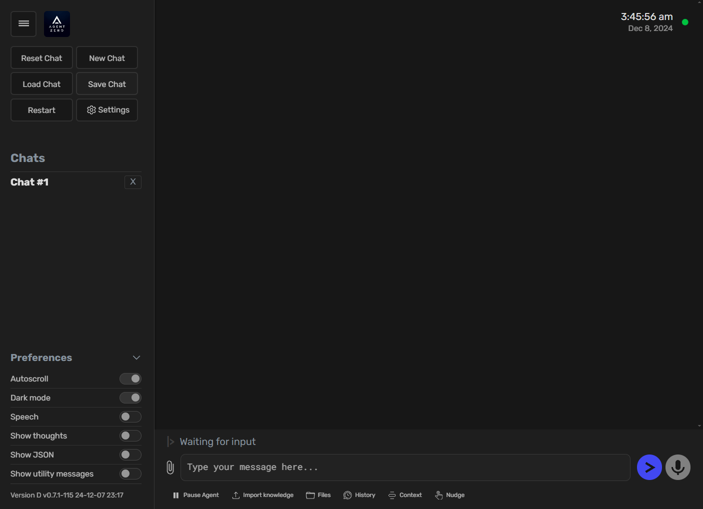

# Quick Start
This guide provides a quick introduction to using Agent Zero via Docker. You'll launch the Web UI, start a new chat, and run a simple task.

## Launching the Web UI (Docker)
1. Install Agent Zero following the [Installation guide](installation.md).
2. Start the Docker container and **map a host port to container port 80** (e.g., `0:80` for a random port).
3. Open your web browser and navigate to `http://localhost:<PORT>`.

> [!TIP]
> The Web UI provides buttons for chat management: `New Chat`, `Reset Chat`, `Save Chat`, and `Load Chat`.
> Chats are stored in `/a0/tmp/chats` inside the container.

> [!NOTE]
> If you prefer running Agent Zero locally without Docker, follow the setup in [development.md](development.md).

## Running a Simple Task
Let's ask Agent Zero to download a YouTube video:

1. Type "Download a YouTube video for me" in the chat input and send the message.
2. Agent Zero will plan the task and typically use `code_execution_tool` to run a script.
3. When prompted, provide the YouTube URL.

## Example Interaction

## Next Steps
Now that you've run a simple task, you can try more advanced requests:

* Perform calculations
* Search the web for information
* Execute shell commands
* Create or modify files

> [!TIP]
> The [Usage Guide](usage.md) covers tools, projects, tasks, and prompt workflows in more detail.
